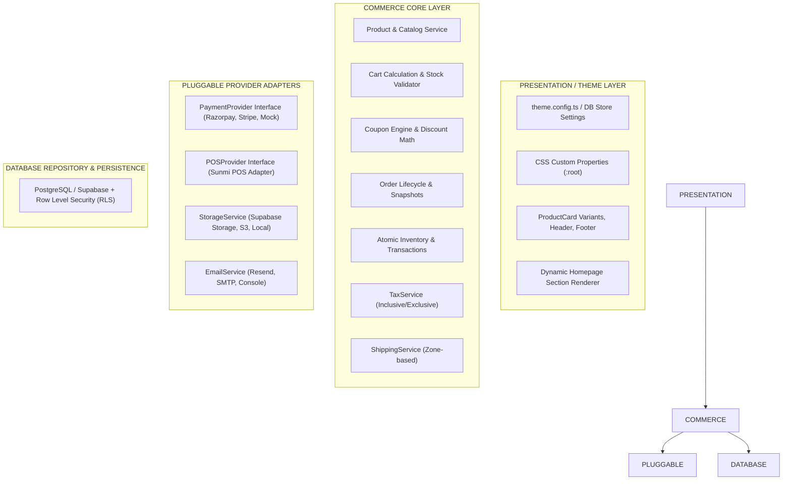

# 🏛️ Architectural Specification: Aura Luxury E-Commerce Engine

## 1. Core Architectural Principle: Core vs Theme Decoupling

The primary architectural goal of this platform is to serve as an **agency-owned starter platform** that can be cloned and deployed across 3–5+ distinct commercial clients with minimal engineering overhead.

To achieve this, the entire codebase strictly divides into two non-overlapping tiers:



### A. The Commerce Core
Contains business-critical domain logic that **never changes** between clients:
- Catalog queries, category hierarchies, dynamic variant lookups
- Anti-tampering cart recalculation and stock validation
- Order creation with immutable snapshots of pricing, SKU, and attributes
- Payment gateway orchestration, HMAC signature verification, and webhook handlers
- Atomic stock decrements and inventory transaction logs
- Coupon validation (min spend, usage limits, discount caps)
- Inclusive/exclusive tax math and zone-based shipping rules

### B. The Presentation / Theme Layer
Contains visual, branding, and layout properties that are **easily replaced** for each client:
- Brand colors, typography pairing, border radiuses, and shadow scales
- Product Card visual variants (`luxury`, `minimal`, `classic`, `modern`, `compact`, `image-focused`)
- Dynamic homepage section order and banner copy
- Store policies, contact information, currency, and country

---

## 2. Pluggable Adapter Pattern

All third-party integrations utilize clean interfaces so that switching infrastructure requires zero modifications to commerce logic:

### PaymentProvider Interface
```typescript
export interface PaymentProvider {
  readonly name: string;
  createPayment(params: CreatePaymentParams): Promise<PaymentInitResult>;
  verifyPayment(params: VerifyPaymentParams): Promise<PaymentVerificationResult>;
  refundPayment(params: RefundPaymentParams): Promise<PaymentRefundResult>;
  handleWebhook(rawBody: string, signature: string): Promise<WebhookResult>;
}
```

### POSProvider Interface (Future Sunmi Hardware Ready)
```typescript
export interface POSProvider {
  readonly name: string;
  createOrder(params: POSCreateOrderParams): Promise<POSSyncResult>;
  syncProduct(params: POSSyncProductParams): Promise<POSSyncResult>;
  syncInventory(params: POSSyncInventoryParams): Promise<POSSyncResult>;
  getOrderStatus(posOrderId: string): Promise<{ status: string; receiptUrl?: string }>;
  cancelOrder(posOrderId: string, reason?: string): Promise<POSSyncResult>;
}
```

---

## 3. Data Flow & Zero-Trust Model

1. **Client interaction**: The customer interacts with the storefront UI.
2. **Server Actions & API Routes**: Next.js App Router route handlers (`/api/checkout`, `/api/cart`) receive requests.
3. **Price & Stock Overwrite**: The server ignores any client-supplied prices, taxes, or shipping costs and queries the database for the active price and stock.
4. **Order Placement**: Inventory is atomically reserved in a database transaction.
5. **Gateway Verification**: The payment signature is verified using cryptographic HMAC-SHA256 before marking the order as `paid`.
