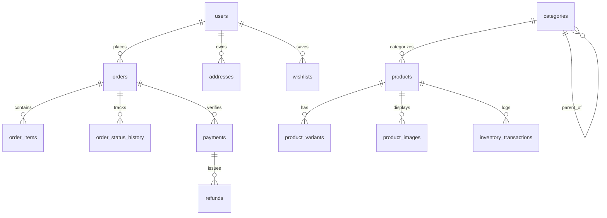

# 🗄️ Database Architecture & Schema Documentation

The platform uses a relational **PostgreSQL / Supabase** schema engineered for performance, strict integrity, and Row Level Security (RLS).

---

## 1. Entity-Relationship Model Overview

---

## 2. Table Specifications

### `users`
- `id` (UUID PK): Supabase Auth UID
- `email` (TEXT UNIQUE): Primary contact
- `name` (TEXT): Full name
- `role` (ENUM): `customer` | `staff` | `admin` | `super_admin`
- `created_at`, `updated_at`: Timestamp

### `products`
- `id` (UUID PK)
- `name`, `slug` (TEXT UNIQUE), `sku` (TEXT UNIQUE)
- `price`, `compare_at_price`, `cost_price` (NUMERIC(12, 2))
- `stock_quantity`, `low_stock_threshold` (INT)
- `status` (ENUM): `draft` | `active` | `archived` | `out_of_stock`
- `featured` (BOOLEAN)
- `category_id` (UUID FK -> `categories.id`)
- `seo_title`, `seo_description` (TEXT)

### `product_variants`
- `id` (UUID PK)
- `product_id` (UUID FK -> `products.id`)
- `sku` (TEXT UNIQUE), `price` (NUMERIC), `stock` (INT)
- `attributes` (JSONB e.g. `{"Size": "M", "Color": "Charcoal"}`)

### `orders` & `order_items`
- `orders.order_number` (TEXT UNIQUE e.g. `AURA-982144`)
- `orders.status` (ENUM): `pending`, `paid`, `confirmed`, `processing`, `packed`, `shipped`, `out_for_delivery`, `delivered`, `cancelled`, `refunded`
- `orders.payment_status` (ENUM): `pending`, `authorized`, `captured`, `failed`, `refunded`
- `orders.shipping_address` & `orders.billing_address` (JSONB Snapshot)
- `order_items`: Stores frozen immutable price snapshot, product name, image, and SKU at time of sale.

### `inventory_transactions`
Audit trail of every stock modification:
- `product_id`, `variant_id`
- `quantity_change` (positive or negative delta)
- `transaction_type`: `purchase`, `sale`, `refund`, `adjustment`, `cancellation`, `reservation`
- `reference_id`, `note`

---

## 3. Atomic Stock Procedures & RLS
- The database includes a plpgsql stored procedure `decrement_product_stock_atomic` using `SELECT ... FOR UPDATE` row locking to eliminate race conditions.
- Row Level Security policies ensure customers can only query and mutate their own profile, orders, and addresses.
