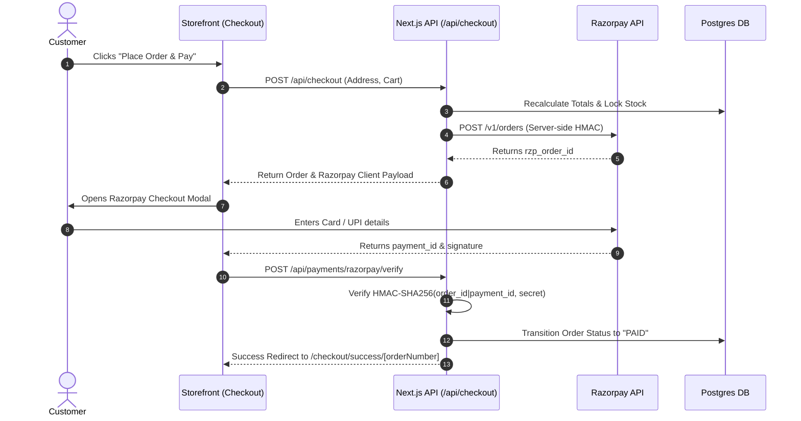

# 💳 Payment Gateway Architecture & Razorpay Integration

The payment architecture utilizes a polymorphic **`PaymentProvider` Interface**, decoupling commerce checkout flows from gateway-specific APIs.

---

## 1. Supported Providers
1. **Razorpay** (`RazorpayProvider`): Primary production integration (Cards, NetBanking, UPI, Wallets, EMI).
2. **Stripe** (`StripeProvider`): International multi-currency credit card processing adapter.
3. **Mock Sandbox** (`MockPaymentProvider`): Zero-credential local test harness.

---

## 2. Razorpay Integration Flow



---

## 3. Cryptographic Signature Verification
To prevent malicious clients from intercepting or forging payment success callbacks, the server computes the HMAC SHA256 digest:

```typescript
const generatedSignature = crypto
  .createHmac("sha256", process.env.RAZORPAY_KEY_SECRET!)
  .update(`${providerOrderId}|${paymentId}`)
  .digest("hex");

if (generatedSignature !== receivedSignature) {
  throw new Error("Tampering detected: signature mismatch");
}
```

---

## 4. Webhook Processing & Idempotency
- **Endpoint**: `/api/payments/webhook`
- Handles asynchronous capture events `payment.captured`, `payment.failed`, and `refund.processed`.
- Verifies `X-Razorpay-Signature` against `RAZORPAY_WEBHOOK_SECRET`.
